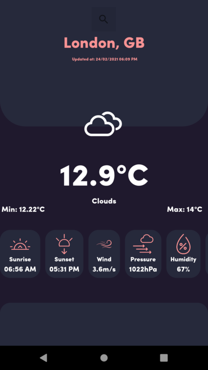

# WeatherApp

 WeatherApp is a weather forecast app, which uses [OpenWeatherMap](https://openweathermap.org/api) API.

# Screenshots

# Features

Obtain in real time:

• Temperature

• Pressure

• Humidity

• Wind speed

# Support

If you've found an error in this sample, please file an issue: [WeatherApp Issues](https://github.com/VitorCezila/WeatherApp/issues)

Patches are encouraged, and may be submitted by forking this project and submitting a pull request through GitHub.
